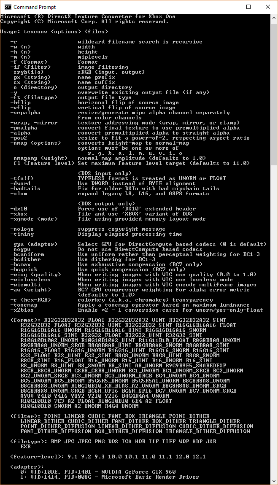

# xtexconv 示例

此示例与 Microsoft 游戏开发工具包预览版（2019 年 11 月）兼容

# 说明

本示例是一种电脑端命令行工具，它扩展了用于纹理转换和准备的标准 TexConv
命令行工具，以支持 Xbox One 离线纹理平铺，与 CreatePlacedResourceX API
结合使用。

此工具接受各种图像格式，例如支持 Windows 图像处理组件的编解码器
.jpg、.png、.tiff、.bmp 和 HD 照片/JPEG XR 加 Targa Truevision .tga
文件、RGBE .hdr 和 OpenEXR .exr 文件，以及
.dds（作为输入纹理格式）。它支持使用用户指定的筛选器生成完整的 MIP
链，用来支持纹理数组、立方体映射、立方体映射数组和卷映射。

在没有任何参数的情况下运行此工具，显示如下所示的帮助画面。

# 用法

XTexConv 工具与标准 TexConv
工具支持相同的一组命令行参数和语法。[GitHub](https://github.com/Microsoft/DirectXTex/wiki/Texconv)
上提供了详细的文档。

它包括一个额外的开关"-xbox"，这个开关使输出 DDS 文件包含 Xbox One
平铺纹理数据和"XBOX"DDS 文件变体。所用的平铺模式由
XGComputeOptimalTileMode 确定。假设这些离线准备的 Xbox One 纹理与
XG_BIND_SHADER_RESOURCE 一起使用。

如果使用"XBOX"DDS
文件变体作为输入文件，在进一步处理之前，该文件会自动取消平铺，从而使该工具可以将"XBOX"DDS
文件转换为标准 DDS 文件。

此工具还支持使用开关"-xgmode"选择用于平铺的硬件版本。

使用"-xgmode:xboxonex"为 Xbox One X 设置首选平铺。如果不设置，则默认为
Xbox One / Xbox One S。

## Project Scarlett

Project Scarlett 和 Xbox One 都有各自的 XG 版本，所以 xtexconv
有两个版本，xteconv_xs 是适用于 Project Scarlett 的版本，它不支持
-xgmode 开关。

# 用于 Xbox One 的 DDS 文件

[Microsoft
Docs](https://docs.microsoft.com/en-us/windows/desktop/direct3ddds/dx-graphics-dds-pguide)
中介绍了标准 DDS 文件格式。"XBOX"DDS
文件类型与"DX10"标头扩展类似。"XBOX"DDS 文件的布局如下：

> DWORD dwMagic
>
> DDS_HEADER header
>
> DDS_HEADER_XBOX
>
> {
>
> DXGI_FORMAT dxgiFormat;
>
> uint32_t resourceDimension;
>
> uint32_t miscFlag; // see DDS_RESOURCE_MISC_FLAG
>
> uint32_t arraySize;
>
> uint32_t miscFlags2; // see DDS_MISC_FLAGS2
>
> uint32_t tileMode; // see XG_TILE_MODE / XG_SWIZZLE_MODE
>
> uint32_t baseAlignment;
>
> uint32_t dataSize;
>
> uint32_t xdkVer; // matching \_XDK_VER
>
> } headerXbox
>
> \<文件的其余部分是适用于 CreatePlacement API 的平铺纹理二进制布局\>

XboxDDSTextureLoader
([DX11](https://github.com/Microsoft/DirectXTK/wiki/XboxDDSTextureLoader)
/ [DX
12](https://github.com/Microsoft/DirectXTK12/wiki/XboxDDSTextureLoader))
模块中的 DirectX 工具包 ([DX11](https://github.com/Microsoft/DirectXTK)
/ [DX 12](https://github.com/Microsoft/DirectXTK12)) 提供了从"XBOX"变体
DDS 文件加载和创建纹理的示例代码。

# 适用于 Xbox One 的 DirectXTex

# XTexConv 版本在 TexConv 的基础上稍作修改，向 [DirectXTex](https://github.com/Microsoft/DirectXTex/) 库中添加了一些附加功能。GitHub 上提供了 [TexConv](https://github.com/Microsoft/DirectXTex/wiki/Texconv) 和 DirectXTex 的标准版本。

# DirectXTex 的 Xbox one 辅助功能（在 Xbox C++ 命名空间中的 DirectXTexXbox.h 中）包括：

-   # XboxImage：这是用于平铺纹理数据的容器

-   用于存储和加载 DDS 文件的 XBOX 变体的函数

    -   GetMetadataFromDDSMemory

    -   GetMetadataFromDDSFile

    -   LoadFromDDSMemory

    -   LoadFromDDSFile

    -   SaveToDDSMemory

    -   SaveToDDSFile

-   用于将标准线性数据平铺到 Xbox One 平铺纹理，以及反向操作的函数：

    -   Tile

    -   Detile

-   用于通过 Direct3D 12 扩展从平铺 Xbox One 平铺图像创建纹理资源的函数

    -   CreateTexture

    -   FreeTextureMemory

# 依赖项

此工具和适用于 Xbox One 的 DirectXTex 辅助 Tile/Detile 函数需要让
XG.DLL（位于"bin\\XboxOne"文件夹下的 Microsoft GDK 中）或
XG_XS.DLL（位于"bin\\Scarlett"文件夹下的 Microsoft GDK 中）位于标准 DLL
搜索路径中。

# OpenEXR 支持

xtexconv 工具使用 [OpenEXR](http://www.openexr.com/) 库，利用
[openexr](https://www.nuget.org/packages/openexr-msvc14-x64/) 和
[zlib](https://www.nuget.org/packages/zlib/) 的 NuGet
包，它们均受各自的许可条款约束。取消定义 USE_OPENEXR、删除
DirectXTexEXR.\*，并通过 NuGet 管理器删除包，可以禁用此支持。

请注意，OpenEXR 和 [zlib](http://zlib.net/zlib_license.html)
一样，都有自己的[许可证](https://github.com/openexr/openexr/blob/develop/OpenEXR/LICENSE)。

有关更多详细信息，请参阅[添加
OpenEXR](https://github.com/Microsoft/DirectXTex/wiki/Adding-OpenEXR)。

# 更新历史记录

