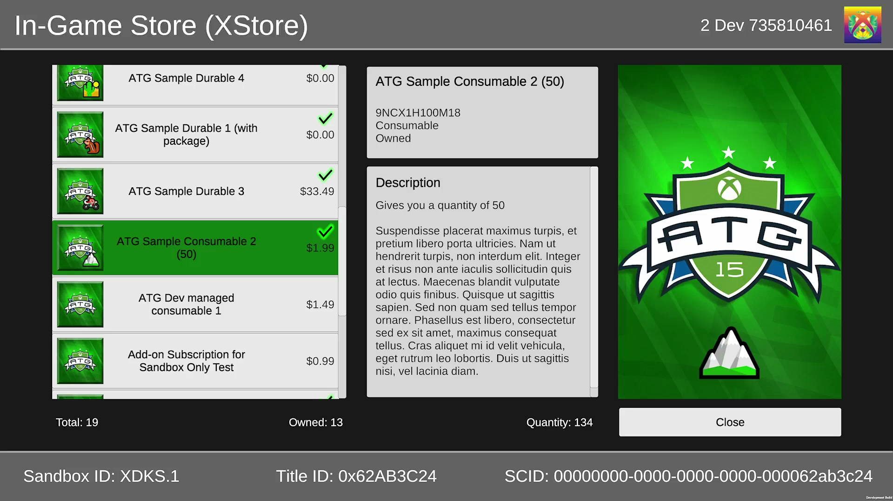
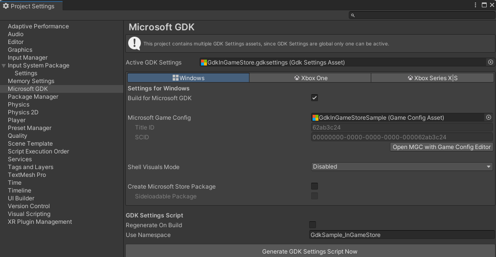
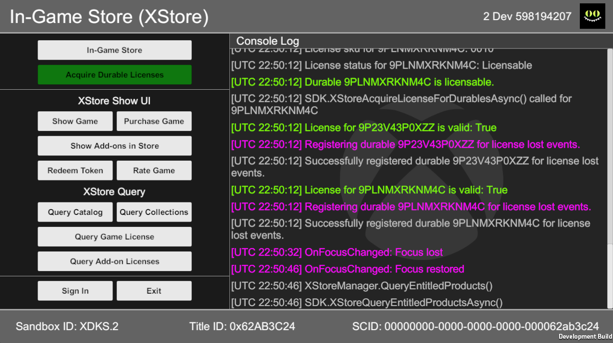
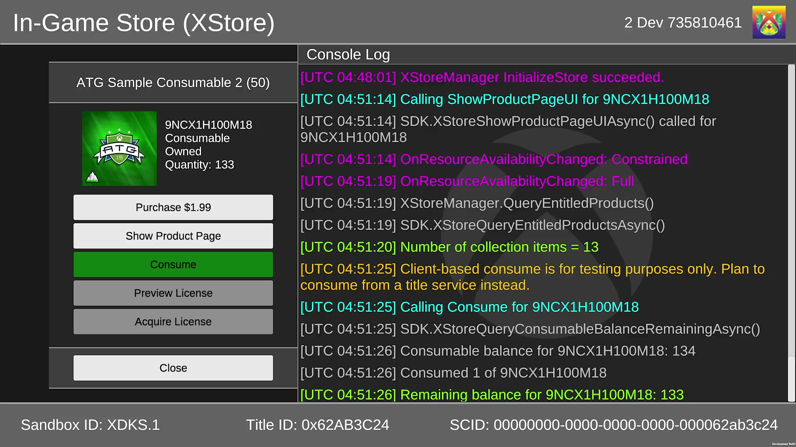
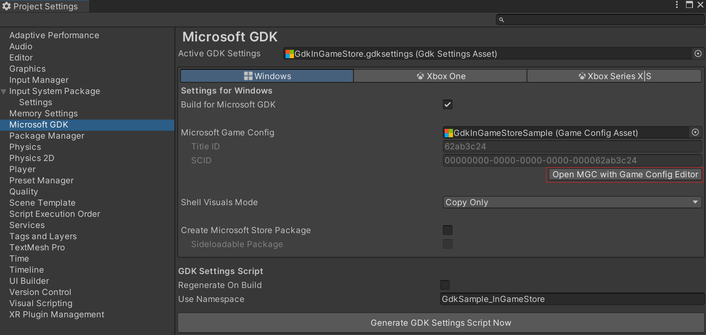
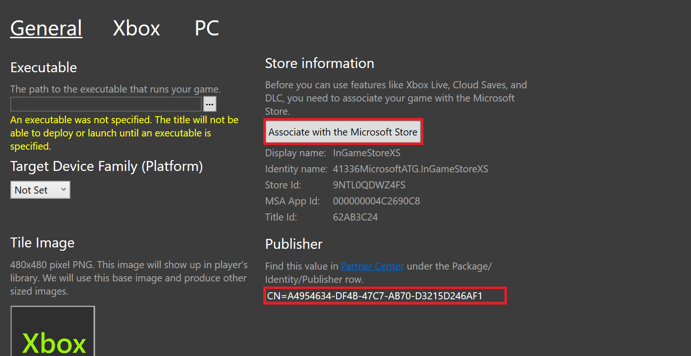
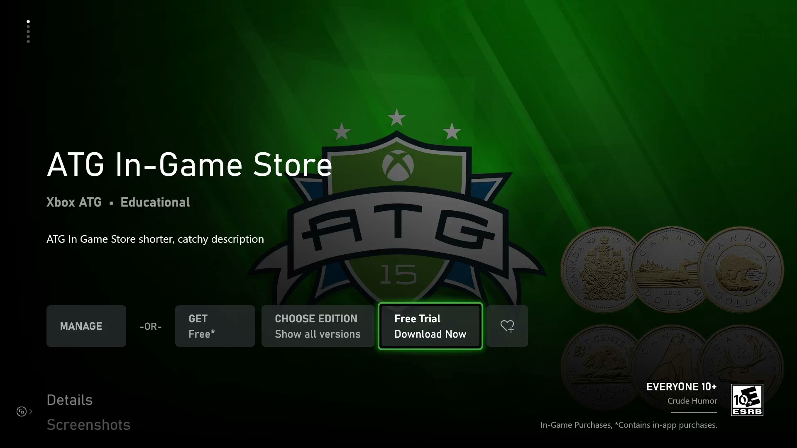
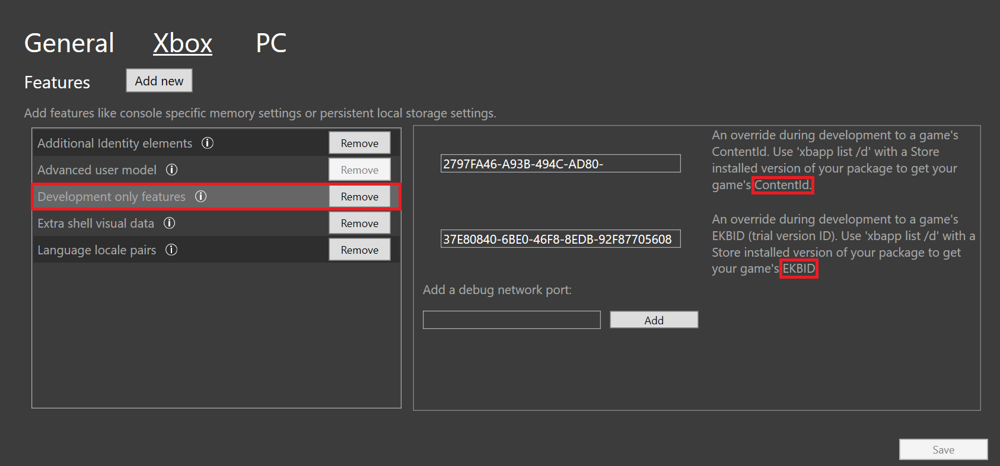
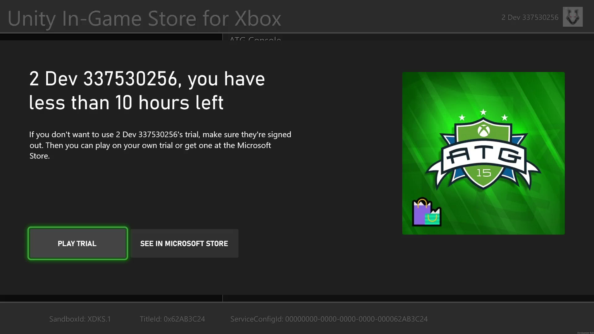

  

# Unity In-Game Store

This sample is a port of the [C++ In-Game Store sample](https://github.com/microsoft/Xbox-GDK-Samples/tree/main/Samples/Live/InGameStore) provided by the Xbox ATG team. It is compatible with:

- [Microsoft GDK](https://github.com/microsoft/GDK/releases/tag/June_2024) or [Microsoft GDKX](https://www.microsoft.com/en-us/software-download/gdk) June 2024 (10.0.25398.4271) & Later

- [Unity Editor](https://unity.com/releases/editor/archive) 6000.0.23f1, 2022.3.49f1, 2021.3.45f2 & Later

- [Microsoft GDK API](https://docs.unity3d.com/Packages/com.unity.microsoft.gdk@1.4/manual/index.html) 1.2.3 & Later (available via Unity's Package Manager)

- [Microsoft GDK Tools](https://docs.unity3d.com/Packages/com.unity.microsoft.gdk.tools@1.4/manual/index.html) 1.2.3 & Later (available via Unity's Package Manager)

**Note:** When buidling for console, you must use a version of the Unity Editor that supports your target GDKX version.
See [**Building for console**](#building-for-console) for more information.

*If developing with the legacy (now deprecated) Unity GameCore packages instead of the Microsoft GDK packages listed above, use the October 2024 version of **GDKX Unity Samples** available from the [GDK Download site](https://www.microsoft.com/en-us/software-download/gdk) (set file type to 'GDK' and build/version to 'Microsoft October 2024 GDKX Unity Samples)*.

#

# Description

The **Unity In-Game Store** sample demonstrates the usage of Xbox commerce APIs ([XStore](https://learn.microsoft.com/en-us/gaming/gdk/_content/gc/reference/system/xstore/xstore_members)) using the Unity game engine.
You can retrieve the game license, query for add-on content available for purchase, and retrieve entitled products that the user has already purchased.
This sample provides a visual store interface to display product and ownership details, and enables browsing, purchasing and licensing of content.

If you are new to commerce, be sure to check out the [Commerce](https://learn.microsoft.com/en-us/gaming/gdk/_content/gc/commerce/commerce-nav) overview provided in the GDK documentation.

# Notable Code Files

### Assets\InGameStore\Scripts

- *XboxManager.cs* - provides sign-in logic and handles 'user change' events.
The store cannot function without a user signed into Xbox.

- *XStoreManager.cs* - creates the store context, initializes the store, provides access to global variables and state, and monitors for 'license lost' events.

### Assets\InGameStore\Scripts\XStore

- *XStoreDownload.cs* - provides support for downloading/installing a durable with a package.

- *XStoreLicensing.cs* - contains game license queries and support for previewing/acquiring durable licenses.

- *XStorePLM.cs* - handles 'Process Lifetime Management' events for the in-game store.
This contains the only code that differs between PC and Xbox.

- *XStoreQueries.cs* - calls XStoreQuery* APIs to retrieve product information from the store catalog and user entitlements (collections).

- *XStoreShowUI.cs* - calls XStoreShow* APIs to open the Microsoft Store app.

### Assets\InGameStore\Scripts\XStoreUI\Menus

- *ItemMenu.cs* - registers acquired durable licenses for 'license lost' events and provides consume functionality to test consumable products.

# Building the Sample

For general guidance on using the GDK with Unity, see [Unity GDK integration for PC: get started](https://learn.microsoft.com/en-us/gaming/gdk/docs/gdk-dev/pc-dev/tutorials/get-started-with-unity-pc/gdk-unity-end-to-end-guide).

The following steps are provided to help troubleshoot common issues when building the sample:

1. After opening the project, you may need to add the following components via Unity's **Package Manager** to resolve any errors:

     - Microsoft GDK API (com.unity.microsoft.gdk) - version 1.2.3 (or later).

     - Microsoft GDK Tools (com.unity.microsoft.gdk.tools) - version 1.2.3 (or later).

     - Input System (com.unity.inputsystem) - version 1.7.0 (or later).
     Switching to the new Input System will require an Editor restart.

2. Set the sample's Input Action Asset to be used as the project-wide input actions (Assets\InGameStore\GdkInGameStoreInputManager.inputactions).

3. Activate the sample's GDK Settings Asset (double-click on Assets\InGameStore\GdkInGameStore.gdksettings.asset).

4. Open 'Edit > Project Settings > Microsoft GDK' to confirm 'Build for Microsoft GDK' is checked:

5. Open 'File > Build Settings' to confirm that the sample scene (Assets\InGameStore\InGameStore.unity) is added to the 'Scenes In Build' section.

### Building for PC

On the **Build Settings** page, set Platform to 'Windows, Mac, Linux', target platform to 'Windows' and architecture to 'Intel 64-bit'.
Use 'Build' to build the project, or 'Build and Run' to build and deploy to your development PC.

### Building for Console

There are additional package requirements when building for console.
The following packages are available from the [Unity Xbox Forums](https://discussions.unity.com/t/unity-for-game-core-downloads/778704).
However, they are under **NDA** status and you will need to join [ID@Xbox](https://www.xbox.com/en-us/Developers/id) to gain access.

- Unity Game Core Series (Scarlett) Add-on (version depends on Unity Editor and GDKX combo)

- Unity Game Core Xbox One Add-on (version depends on Unity Editor and GDKX combo)

- [Microsoft GDK Tools for Xbox](https://discussions.unity.com/t/microsoft-gdk-tools-xbox-1-0-2-is-now-available/1531731) (com.unity.microsoft.gdk.tools.xbox) - version 1.0.2 (or later)

- [GXDK Input System](https://discussions.unity.com/t/gxdk-input-system-1-0-2-bc4cf1f9/1587298) (com.unity.inputsystem.gxdk) - version 1.0.2 (or later)

To build for console, switch Unity's build target on the **Build Settings** page to 'Xbox One' or 'Xbox Series'.
Afterwards, you can use '*Build and Run*' to deploy to the default console that you set via [Xbox Manager](https://learn.microsoft.com/en-us/gaming/gdk/_content/gc/tools-console/xbox-tools-and-apis/xbom/xbom).

# Running the Sample

The device sandbox **must** be set to XDKS.1 for the sample to work with the default configuration. All @xboxtest.com accounts have access to this sandbox.

You need to sign in with an Xbox Live test account before [XStoreCreateContext](https://learn.microsoft.com/en-us/gaming/gdk/_content/gc/reference/system/xstore/functions/xstorecreatecontext) is called to initialize the store.
A valid context is required for most store operations.

On PC, if a different account is signed into the Xbox App and/or Microsoft Store, then the sample will display a failure message during store initialization and you will need to sync the accounts before signing into the title again. See [Switching sandboxes properly for Store operations](https://learn.microsoft.com/en-us/gaming/gdk/docs/store/commerce/pc-specific-considerations/xstore-switching-pc-sandbox-for-store) for more information.

Follow these steps to ensure that your PC is configured correctly:

1. Open a GDK command prompt and run 'XblPCSandbox.exe XDKS.1' to set the PC's sandbox to XDKS.1.

2. Sign into the **Xbox App** with a test account that has access to the sandbox (all @xboxtest.com accounts have access to XDKS.1).

3. Sign into the **Microsoft Store** with the same test account before launching the game.

If you want to run the sample as your own title within your development sandbox, you can use the '*Store Association*' wizard to alter the Microsoft Game configuration.
For more information, see [**Configuring the Sample**](#configuring-the-sample).

### Main Menu

The '*Main Menu*' offers multiple options for interacting with the store at the game level.
Results of each call are displayed in the console window.

*XStore Show Commands:*

- *Show Game* -- calls [XStoreShowProductPageUIAsync](https://learn.microsoft.com/en-us/gaming/gdk/_content/gc/reference/system/xstore/functions/xstoreshowproductpageuiasync) with the storeId of the base game.

- *Purchase Game* -- calls [XStoreShowPurchaseUIAsync](https://learn.microsoft.com/en-us/gaming/gdk/_content/gc/reference/system/xstore/functions/xstoreshowpurchaseuiasync) with the storeId of the base game.

- *Show Add-ons in Store* -- calls [XStoreShowAssociatedProductsUIasync](https://learn.microsoft.com/en-us/gaming/gdk/_content/gc/reference/system/xstore/functions/xstoreshowassociatedproductsuiasync) with the storeId of the base game.

- *Redeem Token* -- calls [XStoreShowRedeemTokenUIAsync](https://learn.microsoft.com/en-us/gaming/gdk/_content/gc/reference/system/xstore/functions/xstoreshowredeemtokenuiasync) for the user to redeem a token within the game.

- *Rate Game* -- calls [XStoreShowRateAndReviewUIAsync](https://learn.microsoft.com/en-us/gaming/gdk/_content/gc/reference/system/xstore/functions/xstoreshowrateandreviewuiasync) for the user to submit a star rating and/or written review of the game.

*XStore Query Commands:*

- *Query Catalog* -- calls [XStoreQueryAssociatedProductsAsync](https://learn.microsoft.com/en-us/gaming/gdk/_content/gc/reference/system/xstore/functions/xstorequeryassociatedproductsasync) to retrieve all add-on products that can be sold by the title.

- *Query Collections* -- calls [XStoreQueryEntitledProductsAsync](https://learn.microsoft.com/en-us/gaming/gdk/_content/gc/reference/system/xstore/functions/xstorequeryentitledproductsasync) to retrieve all add-on products that the user has entitlements for.

- *Query Game License* -- calls [XStoreQueryGameLicenseAsync](https://learn.microsoft.com/en-us/gaming/gdk/_content/gc/reference/system/xstore/functions/xstorequerygamelicenseasync) to retrieve a license for the game.
If the license is valid, it will call [XStoreQueryLicenseTokenAsync](https://learn.microsoft.com/en-us/gaming/gdk/_content/gc/reference/system/xstore/functions/xstorequerylicensetokenasync) to get the license token.

- *Query Add-on Licenses* -- calls [XStoreQueryAddOnLicensesAsync](https://learn.microsoft.com/en-us/gaming/gdk/_content/gc/reference/system/xstore/functions/xstorequeryaddonlicensesasync) to get a list of durable add-ons that the user *might* be able to license.

*Additional Controls:*

- *In-Game Store* -- launches the '*Product List Menu*', which provides a visual display of all add-on products available to the user.
If the user does not currently have a full license to the game (owned or shared), then the base game offer will be included in the product list.

- *Sign In* -- opens the Xbox account picker.
A user is required for all store operations.
Whenever a new user is signed-in, the XStoreContext will be recreated and the products refreshed.

- *Exit Game* -- releases all license handles and exits the game.

- *Clear Logs* -- clears the console of all existing logs.

### Product List Menu

The '*Product List Menu*' displays product details and images for all content returned from the Microsoft Store catalog and collections services that are relevant to the current user.

*Controls:*

- *Product Scroll View* -- scrollable button list for content browsing and selection.

- *Product Button* -- displays the logo icon, name, and price of an individual product.
If the product is owned by the user, a checkmark icon will be visible.
Selecting this button will open the '*Item Menu*' for the corresponding product.

- *Close* -- closes the '*Product List Menu*' and activates the '*Main Menu*'.
Pressing 'B' on the Xbox controller or 'Backspace' on the keyboard will also trigger this operation.

### Item Menu

The '*Item Menu*' offers multiple options for interacting with the store at the individual add-on level.
Results of each call are displayed in the console window.
Available options are dependent on product type (consumable, durable, durable with a package).

*Controls:*

- *Purchase* -- launches the purchase flow for the displayed product via [XStoreShowPurchaseUIAsync](https://learn.microsoft.com/en-us/gaming/gdk/_content/gc/reference/system/xstore/functions/xstoreshowpurchaseuiasync).
Enabled for all catalog products.

- *Show Product Page* -- shows the product details page in the Microsoft Store by calling [XStoreShowProductPageUIAsync](https://learn.microsoft.com/en-us/gaming/gdk/_content/gc/reference/system/xstore/functions/xstoreshowproductpageuiasync).
Enabled for all products (catalog + collections).

- *Consume* -- consumes 1 quantity from the user's consumable balance in the Microsoft Store by calling [XStoreReportConsumableFulfillmentAsync](https://learn.microsoft.com/en-us/gaming/gdk/_content/gc/reference/system/xstore/functions/xstorereportconsumablefulfillmentasync).
Enabled for consumable products.

- *Download and Install* -- adds the product to the download and installation queue by calling [XStoreDownloadAndInstallPackageAsync](https://learn.microsoft.com/en-us/gaming/gdk/_content/gc/reference/system/xstore/functions/xstoredownloadandinstallpackagesasync).
Only enabled for durables with a package.

- *Preview License* -- checks if the durable product is licensable to the user by calling either [XStoreCanAcquireLicenseForStoreIdAsync](https://learn.microsoft.com/en-us/gaming/gdk/_content/gc/reference/system/xstore/functions/xstorecanacquirelicenseforstoreidasync) or [XStoreCanAcquireLicenseForPackageAsync](https://learn.microsoft.com/en-us/gaming/gdk/_content/gc/reference/system/xstore/functions/xstorecanacquirelicenseforpackageasync).
Enabled for durables with and without a package.

- *Acquire License* -- acquires a license for the durable item by calling either [XStoreAcquireLicenseForDurablesAsync](https://learn.microsoft.com/en-us/gaming/gdk/_content/gc/reference/system/xstore/functions/xstoreacquirelicensefordurablesasync) or [XStoreAcquireLicenseForPackageAsync](https://learn.microsoft.com/en-us/gaming/gdk/_content/gc/reference/system/xstore/functions/xstoreacquirelicenseforpackageasync).
If the call succeeds, it checks that the license is valid with [XStoreIsLicenseValid](https://learn.microsoft.com/en-us/gaming/gdk/_content/gc/reference/system/xstore/functions/xstoreislicensevalid).
If the license is valid, it will be registered for *License Lost* events via [XStoreRegisterPacakgeLicenseLost](https://learn.microsoft.com/en-us/gaming/gdk/_content/gc/reference/system/xstore/functions/xstoreregisterpackagelicenselost).
Enabled for durables with and without a package.

- *Close* -- closes the '*Item Menu*' and activates the '*Product List Menu*'.
Pressing 'B' on the Xbox controller or 'Backspace' on the keyboard will also trigger this operation.

# Sample Setup in Partner Center

Game and add-on configuration in Partner Center is beyond the scope of this document.

To get started with configuring your title in Partner Center, see [Initial configuration in Partner Center](https://learn.microsoft.com/en-us/gaming/gdk/_content/gc/commerce/getting-started/xstore-initial-configuration-in-partner-center).
For more information about supported add-on types (consumables, durables, bundles, etc.), see [Choosing the right product type](https://learn.microsoft.com/en-us/gaming/gdk/_content/gc/commerce/getting-started/xstore-choosing-the-right-product-type).

# Configuring the Sample

This sample can run as any title that has been properly configured in Partner Center and published to the Microsoft Store.
Running this sample with your title configuration can be helpful when trying to diagnose Store-related issues with your game.

To configure the sample to run as your title:

- Open **Project Settings > Microsoft GDK**.

- Select '*Open MGC with Game Config Editor*' to alter the sample's configuration.

Under the **General** section of the config editor:

- Set '*Publisher*' to your title's '*Package/Identity/Publisher*' value found in Partner Center.

- Select '*Associate with the Microsoft Store*' and follow the prompts to pull your title's information from Partner Center.

For more information, see [Enabling XStore development and testing](https://learn.microsoft.com/en-us/gaming/gdk/_content/gc/commerce/getting-started/xstore-product-testing-setup).

# Real Licenses and Trial Testing

While the majority of XStore APIs will work with the default test license, some features (trial mode and XStoreQueryAddOnLicensesAsync) will only work when the sample is configured to use a real license.
Real licenses are available for all Store-installed packages, but when using development builds (loose deploy or side-loaded packages), ContentID and EKBID overrides must be set. For more information, see [Enabling license testing](https://learn.microsoft.com/en-us/gaming/gdk/docs/store/commerce/getting-started/xstore-licensing-setup).

This sample has a usage-based trial that expires after N hours of active playtime.
Trial configuration and limits are configured in Partner Center, and requires the title to use the Restrictive Licensing policy.
Contact your Microsoft Account Representative for more details.

In order for the sample to run in trial mode, it must be configured to use a real license. To configure license overrides on console for a loose (push) deploy:

1. Ensure no other account with any license to the sample product is signed in (or present in the case the console is set as 'Home Xbox' for any owner account).

2. Obtain a trial license with a test account (`xbapp launch ms-windows-store://pdp?productid=9NTL0QDWZ4FS`).

3. Download the store package fully.

4. With the package installed in step 3 above, obtain the ContentID and EKBID (`xbapp list /d`).

    - **IMPORTANT:** In the trial scenario it is recommended to use the
        **actual** EKBID from a package downloaded by a trial license
        owner (`xbapp getekbid`).

5. Add override values to development build's MicrosoftGameConfig.mgc

    - Open **Project Settings > Microsoft GDK** and select an Xbox console profile.

    - Select '*Open MGC with Game Config Editor*' to alter the game configuration.

    - Select **Xbox > Development only features** (if missing, use the '*Add new*' option).

    - Set the '*ContentId*' and '*EKBID*' overrides to match the values obtained in step 4 above and press '*Save*' (for this sample, set ContentId = 2797FA46-A93B-494C-AD80-B67C9FCA939F and EKBID = 37E80840-6BE0-46F8-8EDB-92F877056087).

  

6. Uninstall the store package, build and run from Unity.

7. Observe trial attributes in the Sample UI.

    - Trial license details appear in the *Console Log* whenever '*Query Game License*' is called.

    - An upsell offer for the game will appear in the *Product List Menu* when the user owns a trial and/or does not have a full license to the game.

    - If using a [packaged build](https://learn.microsoft.com/en-us/gaming/gdk/_content/gc/packaging/overviews/packaging), a TCUI trial notification will appear whenever the game is launched or resumes from a suspend event.

# Known Issues

- The sample was developed and tested against the packages and versions listed in this document.
Using different versions of the GDK, Microsoft GDK API package, or the Unity Editor may result in build failures and incompatibilities.

- '*Query Add-on Licenses*' (XStoreQueryAddOnLicensesAsync) will return 0 when a test license is used for the game.
To fix this, set the ContentId and EKBID overrides using the steps outlined in [**Real Licenses and Trial Testing**](#real-licenses-and-trial-testing).

- On PC, '*Show Associated Products*' (XStoreShowAssociatedProductsUIAsync) will result in the Microsoft Store displaying a 'No results found' message when running in sandbox or private audience on PC.
This API will only work in RETAIL with add-on content available to the public.

- On PC, '*Show Game*' and '*Show Product Page*' might result in the Microsoft Store displaying a 'No results found' message if the content has not been published to RETAIL.
This is currently a limitation of the Microsoft Store on Windows, which searches for content based on the production catalog.

- On console, '*Rate Game*' will immediately return E_ABORT, as the TCUI that responds to *XStoreShowRateAndReviewUIAsync* was removed.
We recommend calling *XStoreShowProductPageUIAsync* instead, which will show the product details page and includes an option to rate the game.

# Trademarks

This sample may contain trademarks or logos for projects, products, or services.
Authorized use of Microsoft trademarks or logos is subject to and must follow [Microsoft's Trademark & Brand Guidelines](https://www.microsoft.com/en-us/legal/intellectualproperty/trademarks/usage/general).
Use of Microsoft trademarks or logos in modified versions of this sample must not cause confusion or imply Microsoft sponsorship.
Any use of third-party trademarks or logos are subject to those third-party's policies.

# Privacy Statement

This sample adheres to general Microsoft privacy guidelines regarding the distribution of sample source code, documentation, or other material, for the sole private and individual usage by the prospective developer of the APIs referenced within.

For more information about Microsoft's privacy policies in general, see the [Microsoft Privacy Statement](https://privacy.microsoft.com/en-us/privacystatement/).

# Update History

| Description                 |  Release Date       |  Version          |
|-----------------------------|--------------------|------------------|
| Initial draft of sample and README. Includes build requirements, usage details, notes and issues. |  October 2023  |  1.0 |
| Updated the sample to detect trial->full license upgrades and provide basic store-related PLM event handling. |  March 2024  |  1.0 |
| Updated the sample to run on Unity 2022.3.28f1 and to use the latest (legacy) GameCore packages supported by Unity. Future versions of this sample will use the new Microsoft GDK Packages (com.unity.microsoft.gdk, com.unity.microsoft.gdk.tools, com.unity.microsoft.gdk.tools.xbox) available in Package Manager. |  June 2024 |  1.1 |
| Sample now targets both PC and Xbox using the new Microsoft GDK API and tools packages (com.unity.microsoft.gdk, com.microsoft.gdk.tools, com.unity.microsoft.gdk.tools.xbox) available via Unity's Package Manager. | January 2025 | 1.2 |
