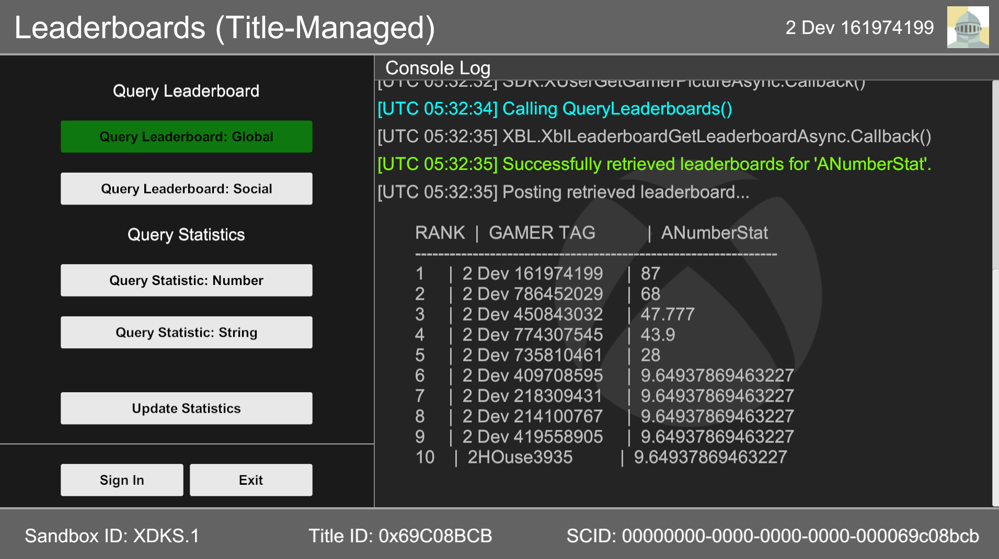
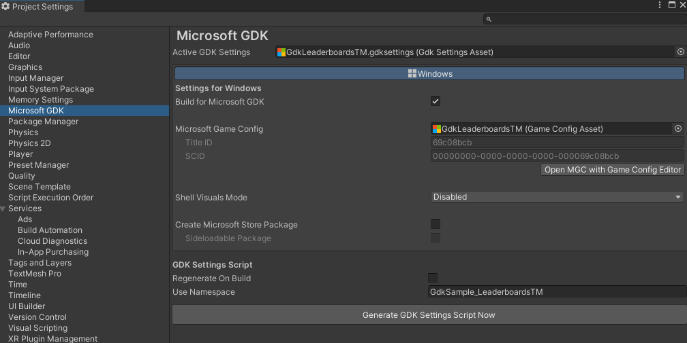
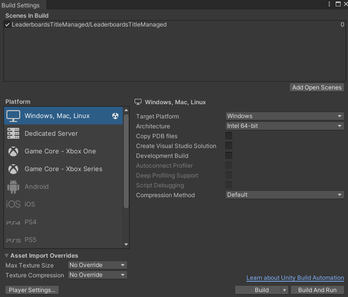
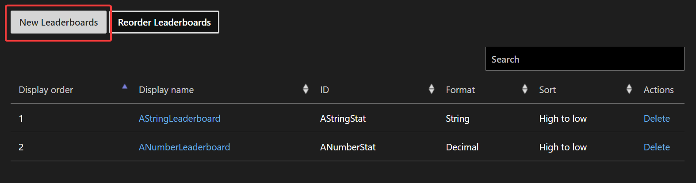
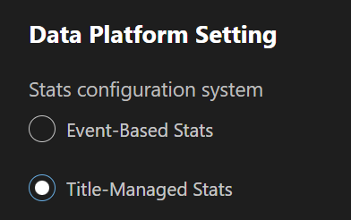
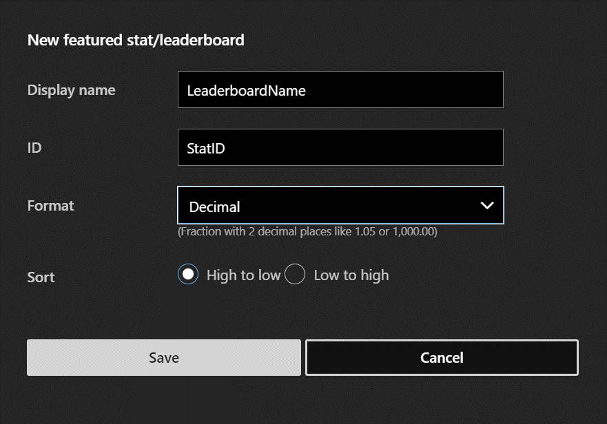

# Unity Leaderboards (Title Managed)

This sample is a port of the [C++ Leaderboards (Title Managed) sample](https://github.com/microsoft/Xbox-GDK-Samples/tree/main/Samples/Live/LeaderboardsTitleManaged) provided by the Xbox ATG team.

It is compatible with:

- [Microsoft GDK](https://github.com/microsoft/GDK/releases/tag/June_2024) or [Microsoft GDKX](https://www.microsoft.com/en-us/software-download/gdk) June 2024 (10.0.25398.4271) & Later

- [Unity Editor](https://unity.com/releases/editor/archive) 6000.0.23f1, 2022.3.49f1, 2021.3.45f2 & Later

- [Microsoft GDK API](https://docs.unity3d.com/Packages/com.unity.microsoft.gdk@1.4/manual/index.html) 1.2.3 & Later (available via Unity's Package Manager)

- [Microsoft GDK Tools](https://docs.unity3d.com/Packages/com.unity.microsoft.gdk.tools@1.4/manual/index.html) 1.2.3 & Later (available via Unity's Package Manager)

**Note:** When buidling for console, you must use a version of the Unity Editor that supports your target GDKX version.
See [**Building for console**](#building-for-console) for more information.

*If developing with the legacy (now deprecated) Unity GameCore packages instead of the Microsoft GDK packages listed above, use the October 2024 version of **GDKX Unity Samples** available from the [GDK Download site](https://www.microsoft.com/en-us/software-download/gdk) (set file type to 'GDK' and build/version to 'Microsoft October 2024 GDKX Unity Samples)*.

#

# Description

The Unity Title-Managed Leaderboards sample demonstrates the usage of Xbox Live Title-Managed Leaderboards using the Unity game engine.
You can update user statistics, query the user's statistics, and query a social and global leaderboard for the numbered statistic.

# Noteable Code Files

**XboxManager.cs**: Contains initialization of the Xbox GDK & Xbox Live Services APIs, along with signing in a user & querying various information, such as Sandbox & Title ID.

**XboxLeaderboards.cs**: Contains queries & updates for the Xbox Live leaderboard APIs.

# Building the Sample

For general guidance on using the GDK with Unity, see [Unity GDK integration for PC: get started](https://learn.microsoft.com/en-us/gaming/gdk/docs/gdk-dev/pc-dev/tutorials/get-started-with-unity-pc/gdk-unity-end-to-end-guide).

The following steps are provided to help troubleshoot common issues when building the sample:

1. After opening the project, you may need to add the following components via Unity's **Package Manager** to resolve any errors:

     - Microsoft GDK API (com.unity.microsoft.gdk) - version 1.2.3 (or later).

     - Microsoft GDK Tools (com.unity.microsoft.gdk.tools) - version 1.2.3 (or later).

     - Input System (com.unity.inputsystem) - version 1.7.0 (or later).
     Switching to the new Input System will require an Editor restart.

2. Set the sample's Input Action Asset to be used as the project-wide input actions (Assets\LeaderboardsTitleManaged\GdkLeaderboardsTMInputManager.inputactions).

3. Activate the sample's GDK Settings Asset (double-click on Assets\LeaderboardsTitleManaged\GdkLeaderboardsTM.gdksettings.asset).

4. Open 'Edit > Project Settings > Microsoft GDK' to confirm 'GdkLeaderboardsTM' is set as the Microsoft Game Config:

    

5. Open 'File > Build Settings' to confirm that the sample scene (Assets\LeaderboardsTitleManaged\LeaderboardsTitleManaged.unity) is included in the 'Scenes In Build' section.

## Building for PC

On the **Build Settings** page, set Platform to 'Windows, Mac, Linux', target platform to 'Windows' and architecture to 'Intel 64-bit'.
Use 'Build' to build the project, or 'Build and Run' to build and deploy to your development PC.

## Building for Console

There are additional package requirements when building for console.
The following packages are available from the [Unity Xbox Forums](https://discussions.unity.com/t/unity-for-game-core-downloads/778704).
However, they are under **NDA** status and you will need to join [ID@Xbox](https://www.xbox.com/en-us/Developers/id) to gain access.

- Unity Game Core Series (Scarlett) Add-on (version depends on Unity Editor and GDKX combo)

- Unity Game Core Xbox One Add-on (version depends on Unity Editor and GDKX combo)

- [Microsoft GDK Tools for Xbox](https://discussions.unity.com/t/microsoft-gdk-tools-xbox-1-0-2-is-now-available/1531731) (com.unity.microsoft.gdk.tools.xbox) - version 1.0.2 (or later)

- [GXDK Input System](https://discussions.unity.com/t/gxdk-input-system-1-0-2-bc4cf1f9/1587298) (com.unity.inputsystem.gxdk) - version 1.0.2 (or later)

To build for console, switch Unity's build target on the **Build Settings** page to 'Xbox One' or 'Xbox Series'.
Afterwards, you can use '*Build and Run*' to deploy to the default console that you set via [Xbox Manager](https://learn.microsoft.com/en-us/gaming/gdk/_content/gc/tools-console/xbox-tools-and-apis/xbom/xbom).

# Running the Sample

You will need an Xbox Live test account signed in to execute update and retrieval commands.

The target device's sandbox **must** be set to XDKS.1.

There are two configured statistics available for this sample:

- 'ANumberStat'

- 'AStringStat'

Both achievement sections act in the same manner for updates &
retrievals.

*Query commands:*

- '*Query Leaderboard: Global*' -- Queries the global leaderboard for
    the title using the 'ANumberStat' statistic.

- '*Query Leaderboard: Social*' -- Queries the social/friend
    leaderboard for the title using the 'ANumberStat' statistic.

- '*Query Statistic: Number*' -- Queries the title's last stored value
    for 'ANumberStat' for the current signed in user.

- '*Query Statistic: String*' -- Queries the title's last stored value
    for 'AStringStat' for the current signed in user.

**IMPORTANT:** Once a statistic has received a higher numeric value, the
statistic will persist for that user in the leaderboards. This statistic
will, however, be updated accordingly & overwrite the previous value.
Additionally,

*Update command:*

- '*Update Statistics'* -- Updates both 'ANumberStat' & 'AStringStat'
    to be a random value between 0 & 100 and a random pre-determined
    string value, respectively.

**IMPORTANT:** String values cannot be used for leaderboards as their
comparison for greater value cannot be determined.

*Additional Commands:*

- '*Sign In'* -- allows for a new user to sign in using the Xbox user
    selection UI.

- '*Clear Logs'* -- Clears the console of all existing logs.

- '*Close' --* Closes the sample.

# Implementation notes

The Title-managed leaderboard API works differently from the Event-based leaderboard API.
Due to these differences, it is recommended for your title to use Event-based stats if possible.

For general documentation on the reasoning and differences between Title-managed stats and Event-based stats, refer to this [documentation](https://learn.microsoft.com/en-us/gaming/gdk/_content/gc/live/features/player-data/stats-leaderboards/live-stats-eb-vs-tm).

Event-based stats/leaderboards implementation differences in Unity:

- Use `XblEventsWriteInGameEvent()` to update statistics.

- When using `XblLeaderboardQuery.Create()` Set the leaderboard type to `XblLeaderboardQueryType.UserStatBacked`.

**IMPORTANT:** For Title-managed leaderboards, it's important to be aware that a player's statistic (accessible via `XblUserStatisticsGet*`) can differ from the value stored on the global leaderboard, resulting in mismatched outputs.
For example, a mismatch can happen when updating a stat with a lower value when a global leaderboard will only maintain the highest recorded value it.
Further reading is available on the page for [XblLeaderboardQuery](https://developer.microsoft.com/en-us/games/xbox/docs/gdk/xblleaderboardquery).

The sample also demonstrates querying of stat values directly.

# Sample Setup in Partner Center

Featured Stats & Leaderboards can be found in '*Gameplay Settings'* underneath the '*Xbox Services'* section in your title's overview bar.
Leaderboards can be added by selecting the '*New Leaderboards'* button.

**IMPORTANT:** In order to enable '*Featured Leaderboards & Stat,'* the '*Data Platform Setting'* must be set to '*Title-Managed Stats'* in the *'Xbox Settings'* tab, found underneath the '*Xbox Services'* section in your title's overview bar.

Once inside, Leaderboards can be customized depending on your needs.
Leaderboards can have:

- Unique names

- Identifier for the stat name to track

- Data type to store (string, integer, decimal, time, etc.)

- Default sorting type

# Known Issues

The sample was developed and tested against the packages and versions listed in this document.
Using different versions of the GDK, Microsoft GDK API package, or the Unity Editor may result in build failures and incompatibilities.

## Trademarks

This sample may contain trademarks or logos for projects, products, or services.
Authorized use of Microsoft trademarks or logos is subject to and must follow [Microsoft's Trademark & Brand Guidelines](https://www.microsoft.com/en-us/legal/intellectualproperty/trademarks/usage/general).
Use of Microsoft trademarks or logos in modified versions of this sample must not cause confusion or imply Microsoft sponsorship.
Any use of third-party trademarks or logos are subject to those third-party's policies.

# Privacy Statement

This sample adheres to general Microsoft privacy guidelines regarding the distribution of sample source code, documentation, or other material, for the sole private and individual usage by the prospective developer of the APIs referenced within.

For more information about Microsoft's privacy policies in general, see the [Microsoft Privacy Statement](https://privacy.microsoft.com/en-us/privacystatement/).

# Update History

| Description                 |  Release Date       |  Version          |
|-----------------------------|--------------------|------------------|
| Initial draft of sample and README. Includes build requirements, usage details, notes and issues. | September 2022 | 1.0 |
| Added Notable Code section. | May 2023 | 1.0 |
| Updated the sample to run on Unity 2022.3.28f1 and the latest (legacy) GDK Unity Package on GitHub. Future versions of this sample will use the new Microsoft GDK Packages (com.unity.microsoft.gdk and com.unity.microsoft.gdk.tools) available in Package Manager. Added notes on Title-managed vs Event-based stats | June 2024 | 1.1 |
| Updated readme with additional notes on Title-managed vs Event-based stats | March 2025 | 1.1 |
| Sample now targets both PC and Xbox consoles using the new Microsoft GDK API and Tools packages (com.unity.microsoft.gdk, com.microsoft.gdk.tools, com.unity.microsoft.gdk.tools.xbox) available via Unity's Package Manager. | June 2025 | 1.2 |
