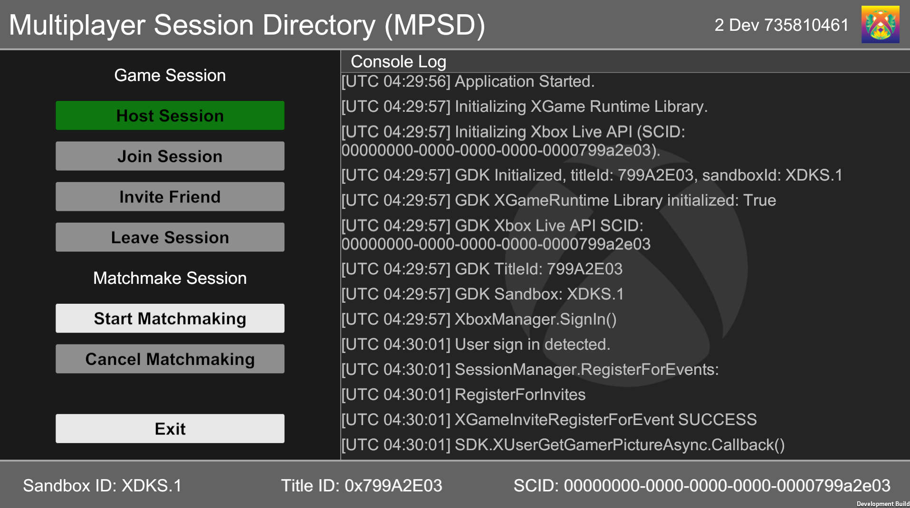
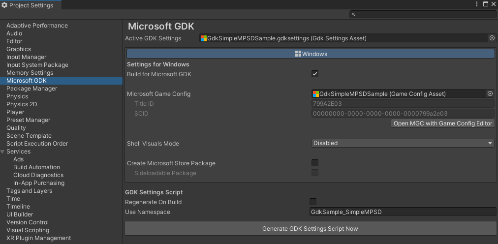
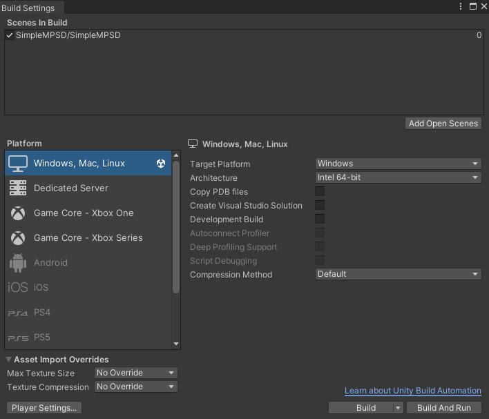
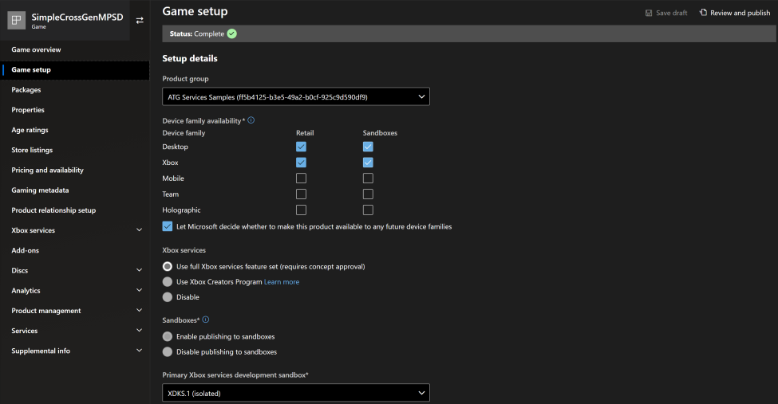
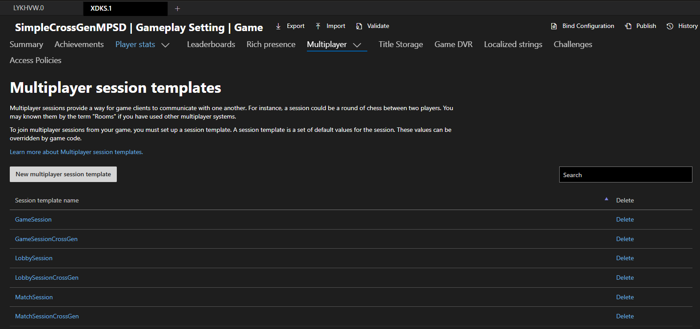
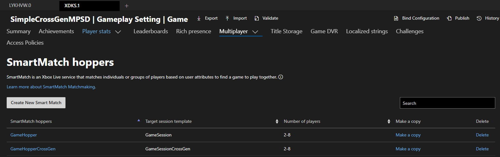

# Unity Simple MPSD

This sample is a port of the C++ [SimpleCrossGenMPSD sample](https://github.com/microsoft/Xbox-GDK-Samples/tree/main/Samples/Live/SimpleCrossGenMPSD) available in the [microsoft/Xbox-GDK-Samples](https://github.com/microsoft/Xbox-GDK-Samples/) repo on GitHub.

It is compatible with:

- [Microsoft GDK](https://github.com/microsoft/GDK/releases/tag/June_2024) or [Microsoft GDKX](https://www.microsoft.com/en-us/software-download/gdk) June 2024 (10.0.25398.4271) & Later

- [Unity Editor](https://unity.com/releases/editor/archive) 6000.0.23f1, 2022.3.49f1, 2021.3.45f2 & Later

- [Microsoft GDK API](https://docs.unity3d.com/Packages/com.unity.microsoft.gdk@1.4/manual/index.html) 1.2.3 & Later (available via Unity's Package Manager)

- [Microsoft GDK Tools](https://docs.unity3d.com/Packages/com.unity.microsoft.gdk.tools@1.4/manual/index.html) 1.2.3 & Later (available via Unity's Package Manager)

**Note:** When buidling for console, you must use a version of the Unity Editor that supports your target GDKX version.
See [**Building for console**](#building-for-console) for more information.

*If developing with the legacy (now deprecated) Unity GameCore packages instead of the Microsoft GDK packages listed above, use the October 2024 version of **GDKX Unity Samples** available from the [GDK Download site](https://www.microsoft.com/en-us/software-download/gdk) (set file type to 'GDK' and build/version to 'Microsoft October 2024 GDKX Unity Samples)*.

#

# Description

This is a simple multiplayer session sample which demonstrates Xbox Live, raw MPSD, and SmartMatch APIs that a developer would use to perform the following functionalities:

- Login into Xbox Live services

- Retrieve Xbox Live profile information

- Start an Xbox Live multiplayer session using MPSD

- Invite Xbox Live friends to join your multiplayer session

- Join a friend's Xbox Live multiplayer session

- Start and cancel a SmartMatch multiplayer session

- Leave a multiplayer session



# Notable Code Files

The sample code, found under the "Assets\SimpleMPSD\Scripts" folder, is broken down primarily into UI, Xbox Live, and Session logic.

**XboxManager.cs**: Contains initialization of the Xbox GDK & Xbox Live Services APIs, along with signing in a user & querying various information, such as Sandbox & Title ID.

**SessionManager.cs**: Contains logic for creating, joining, and leavings multiplayer sessions.

# Building the Sample

For general guidance on using the GDK with Unity, see [Unity GDK integration for PC: get started](https://learn.microsoft.com/en-us/gaming/gdk/docs/gdk-dev/pc-dev/tutorials/get-started-with-unity-pc/gdk-unity-end-to-end-guide).

The following steps are provided to help troubleshoot common issues when building the sample:

1. After opening the project, you may need to add the following components via Unity's **Package Manager** to resolve any errors:

     - Microsoft GDK API (com.unity.microsoft.gdk) - version 1.2.3 (or later).

     - Microsoft GDK Tools (com.unity.microsoft.gdk.tools) - version 1.2.3 (or later).

     - Input System (com.unity.inputsystem) - version 1.7.0 (or later).
     Switching to the new Input System will require an Editor restart.

2. Set the sample's Input Action Asset to be used as the project-wide input actions (Assets\SimpleMPSD\SimpleMPSDInputManager.inputactions).

3. Activate the sample's GDK Settings Asset (double-click on Assets\SimpleMPSD\GdkSimpleMPSDSample.gdksettings.asset).

4. Open 'Edit > Project Settings > Microsoft GDK' to confirm 'GdkSimpleMPSDSample' is set as the Microsoft Game Config:

    

5. Open 'File > Build Settings' to confirm that the sample scene (Assets\SimpleMPSD\SimpleMPSD.unity) is included in the 'Scenes In Build' section.

## Building for PC

On the **Build Settings** page, set Platform to 'Windows, Mac, Linux', target platform to 'Windows' and architecture to 'Intel 64-bit'.
Use 'Build' to build the project, or 'Build and Run' to build and deploy to your development PC.



## Building for Console

There are additional package requirements when building for console.
The following packages are available from the [Unity Xbox Forums](https://discussions.unity.com/t/unity-for-game-core-downloads/778704).
However, they are under **NDA** status and you will need to join [ID@Xbox](https://www.xbox.com/en-us/Developers/id) to gain access.

- Unity Game Core Series (Scarlett) Add-on (version depends on Unity Editor and GDKX combo)

- Unity Game Core Xbox One Add-on (version depends on Unity Editor and GDKX combo)

- [Microsoft GDK Tools for Xbox](https://discussions.unity.com/t/microsoft-gdk-tools-xbox-1-0-2-is-now-available/1531731) (com.unity.microsoft.gdk.tools.xbox) - version 1.0.2 (or later)

- [GXDK Input System](https://discussions.unity.com/t/gxdk-input-system-1-0-2-bc4cf1f9/1587298) (com.unity.inputsystem.gxdk) - version 1.0.2 (or later)

To build for console, switch Unity's build target on the **Build Settings** page to 'Xbox One' or 'Xbox Series'.
Afterwards, you can use '*Build and Run*' to deploy to the default console that you set via [Xbox Manager](https://learn.microsoft.com/en-us/gaming/gdk/_content/gc/tools-console/xbox-tools-and-apis/xbom/xbom).

# Running the Sample

You will need an Xbox Live test account signed in to use this sample.
For most multiplayer options to succeed, you need to run this sample on two different devices using two different test accounts that are friends with each other.

The sandbox **must** be set to XDKS.1 for all devices running the sample.

The next sections will cover the sample functionality, and explain how the sample is expected to behave in a correctly working GDK development environment.

## Sample Main Screen

The title will immediately launch a user login flow for Xbox Live.
If any of the login steps fail, an error message will be presented to the user, and the sample app will cease to function any further.

Common failure situations might include: the user does not have access to the current sandbox, internet connectivity is currently down, or Xbox Live services are experiencing a service disruption of some sort (which could possibly be the result of not running a configured Web services proxy).

Once a test user has been successfully signed into Xbox Live, the sample's main menu will be enabled.

The three main functionalities presented are:

1. Start Matchmaking - match the user with other user(s) running the title using SmartMatch.

2. Host Session - have the user host a game lobby session, and invite other users to join it.

3. Join Seession - join a session associated with an invitation that was already received and accepted by the test user.

## Finding a SmartMatch Session

When choosing the "Start Matchmaking" button option from the main menu, the sample will immediately attempt to matchmake through a matchmaking ticket managed by the Multiplayer Session and Matchmaking APIs.
The matchmake ticket will generally lead to one of two common results:

1. The matchmake ticket could be fulfilled and the matchmake session was created, and all of the members that were match-made together were placed into the new session.
Two or more users must be using Matchmaking for a match to be found.

2. The matchmake ticket could not be fulfilled and timed out.
If that is the result, a message is shown in the log window, and the available main menu options are re-enabled.

A matchmaking ticket can also be cancelled so long as it is still active.
If the matchmaking ticket is cancelled, then the main menu options are re-enabled as if the matchmake request failed.

## The Session "Lobby"

Once the test user has either: successfully been match-made, successfully joined a friend's game lobby through the "Join Session" main menu options, or successfully started to host their own session, the user now has the ability to leave the session.

The console log window UI will show the members that have subsequently joined or left the lobby session.
The "Leave" option allows the user to abort being in the lobby, and if chosen by the user, will result in that member being removed from the lobby member list.

## Host Invite Friend into Lobby

If the test user is hosting the game lobby through the "Host Session" option, then the "Invite Friend" button will be enabled on the sample menu.
Choosing the "Invite Friend" button will present the user with an overlay screen that shows a list of friends that can be invited to join the current game session.

Behind the scenes, the invite APIs are invoked to handle the selection of friends and the server-side invitation protocol mechanics.
If the invitation is not cancelled, then the recipient users, whether in the app or not, will receive a Shell UI notification that they have been given an invitation and they can either accept that invitation, or dismiss it.
If it is accepted, and the user is not currently in a session, the "Join Session" button is enabled on the main menu.

## Invite from Friend Received

As mentioned previously, upon accepting an invitation given by a host user, the "Join Session" button will be enabled for the player and can be used to join the active session.

# Partner Center Configuration

**App overview of the "SimpleCrossGenMPSD" title on Partner Center**



The above screenshot shows the current state of the "SimpleCrossGenMPSD" game title on Partner Center.
The title has been configured and deployed to the XDKS.1 sandbox. There is a total of six multiplayer session template(s) configured for the title: three simple and three cross-gen, along with two SmartMatch hopper(s).

**Multiplayer session templates**



In a common Multiplayer Manager scenario (consult the GDK documentation for further details) we maintain at least 3 session templates: one for the lobby, one for hosted gameplay (the same one *could* be used for matchmade gameplay), and one dedicated for matchmaking.

With the lobby template, we limit the number of participants that a lobby can have to 8.
The invite protocol specifies that the invitation should be given to the game application.
Also, connectivity is required of the members, and this is managed through the RTA (real time activity) service.

We have also not elected to make the session be searchable through the absence of the "searchable" property, and the sample does not demonstrate any search capability.
Finally, we also do not specify the number of members needed to start the lobby session, but the sample implicitly expects it to be one.

**Session templates**

```JSON
{
   "constants": {
        "system": {
            "version": 1,
            "maxMembersCount": 8,
            "visibility": "open",
            "inviteProtocol": "game",
            "capabilities": {
                "connectivity": true,
                "connectionRequiredForActiveMembers": true,
                "gameplay" : true,
                "crossPlay": true,
                "userAuthorizationStyle": true
            },
        },
        "custom": {}
    }
}
```

**SmartMatch Hopper**



## Trademarks

This sample may contain trademarks or logos for projects, products, or services.
Authorized use of Microsoft trademarks or logos is subject to and must follow [Microsoft's Trademark & Brand Guidelines](https://www.microsoft.com/en-us/legal/intellectualproperty/trademarks/usage/general).
Use of Microsoft trademarks or logos in modified versions of this sample must not cause confusion or imply Microsoft sponsorship.
Any use of third-party trademarks or logos are subject to those third-party's policies.

## Privacy Statement

This sample adheres to general Microsoft privacy guidelines regarding
the distribution of sample source code, documentation, or other
material, for the sole private and individual usage by the prospective
developer of the APIs referenced within.

For more information about Microsoft's privacy policies in general, see
the [Microsoft Privacy
Statement](https://privacy.microsoft.com/en-us/privacystatement/).

# Update History

| Description                 |  Release Date       |  Version          |
|-----------------------------|--------------------|------------------|
| Initial draft of README and sample. Includes build requirements, usage details, notes and issues. |  September 2021  |  1.0 |
| Updated the sample to run on Unity 2022.3.28f1 and the latest (legacy) GDK Unity Package on GitHub. Future versions of this sample will use the new Microsoft GDK Packages (com.unity.microsoft.gdk and com.unity.microsoft.gdk.tools) available in Package Manager. | June 2024 | 1.1 |
| Sample now targets both PC and Xbox consoles using the new Microsoft GDK API and Tools packages (com.unity.microsoft.gdk, com.microsoft.gdk.tools, com.unity.microsoft.gdk.tools.xbox) available via Unity's Package Manager. | June 2025 | 1.2 |
