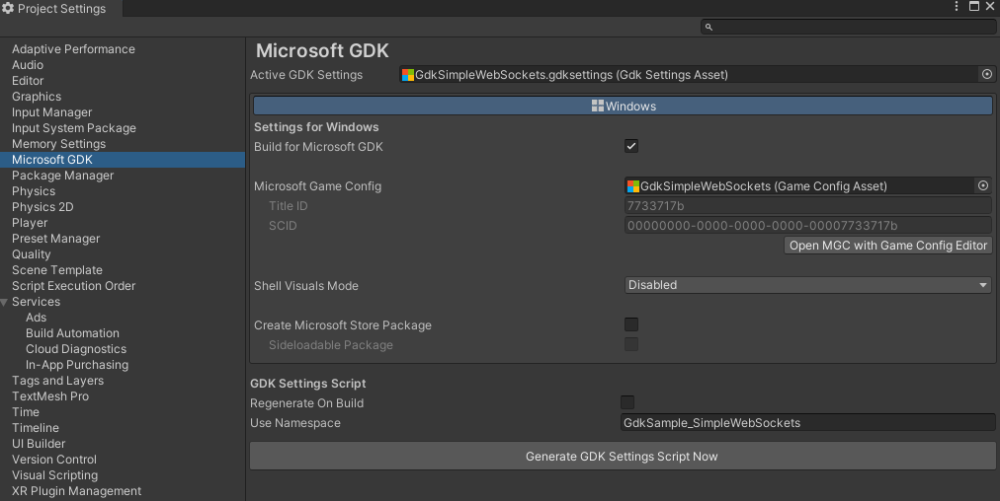
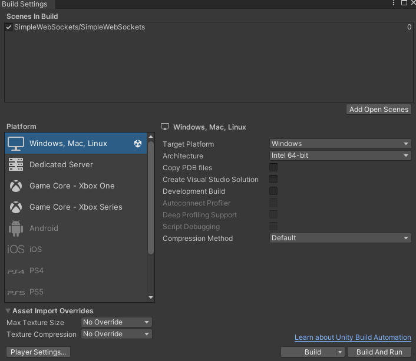

# Unity Simple Web Sockets

This sample is a port of the [C++ SimpleWebSockets sample](https://github.com/microsoft/Xbox-GDK-Samples/tree/main/Samples/Live/SimpleHttp) provided by the Xbox ATG team.

It is compatible with (console only, see [**Known issues**](#known-issues) for details):

- [Microsoft GDK](https://github.com/microsoft/GDK/releases/tag/June_2024) or [Microsoft GDKX](https://www.microsoft.com/en-us/software-download/gdk) June 2024 (10.0.25398.4271) & Later

- [Unity Editor](https://unity.com/releases/editor/archive) 6000.0.23f1, 2022.3.49f1, 2021.3.45f2 & Later

- [Microsoft GDK API](https://docs.unity3d.com/Packages/com.unity.microsoft.gdk@1.4/manual/index.html) 1.2.3 & Later (available via Unity's Package Manager)

- [Microsoft GDK Tools](https://docs.unity3d.com/Packages/com.unity.microsoft.gdk.tools@1.4/manual/index.html) 1.2.3 & Later (available via Unity's Package Manager)

**Note:** When buidling for console, you must use a version of the Unity Editor that supports your target GDKX version.
See [**Building for console**](#building-for-console) for more information.

*If developing with the legacy (now deprecated) Unity GameCore packages instead of the Microsoft GDK packages listed above, use the October 2024 version of **GDKX Unity Samples** available from the [GDK Download site](https://www.microsoft.com/en-us/software-download/gdk) (set file type to 'GDK' and build/version to 'Microsoft October 2024 GDKX Unity Samples)*.

#

# Description

The Unity Simple Web Sockets sample demonstrates the usage of Http Client Web Sockets using the Unity game engine. You can send and receive a binary or string message to a pre-configured web socket endpoint "[https://ws.ifelse.io](https://ws.ifelse.io/)".

# Noteable Code Files

**XboxManager.cs**: Contains initialization of the Xbox GDK and Xbox Live Services APIs, along with signing in a user and querying various information, such as Sandbox and Title ID.

**SimpleWebSocketsSceneManager.cs**: Contains APIs to make web socket calls through Xbox.

# Building the Sample

For general guidance on using the GDK with Unity, see [Unity GDK integration for PC: get started](https://learn.microsoft.com/en-us/gaming/gdk/docs/gdk-dev/pc-dev/tutorials/get-started-with-unity-pc/gdk-unity-end-to-end-guide).

The following steps are provided to help troubleshoot common issues when building the sample:

1. After opening the project, you may need to add the following components via Unity's **Package Manager** to resolve any errors:

     - Microsoft GDK API (com.unity.microsoft.gdk) - version 1.2.3 (or later).

     - Microsoft GDK Tools (com.unity.microsoft.gdk.tools) - version 1.2.3 (or later).

     - Input System (com.unity.inputsystem) - version 1.7.0 (or later).
     Switching to the new Input System will require an Editor restart.

2. Set the sample's Input Action Asset to be used as the project-wide input actions (Assets\SimpleWebSockets\GdkSimpleWebSocketsInputManager.inputactions).

3. Activate the sample's GDK Settings Asset (double-click on Assets\SimpleWebSockets\GdkSimpleWebSockets.gdksettings.asset).

4. Open 'Edit > Project Settings > Microsoft GDK' to confirm 'GdkSimpleWebSockets' is set as the Microsoft Game Config:

    

5. Open 'File > Build Settings' to confirm that the sample scene (Assets\SimpleWebSockets\SimpleWebSockets.unity) is included in the 'Scenes In Build' section.

## Building for PC

On the **Build Settings** page, set Platform to 'Windows, Mac, Linux', target platform to 'Windows' and architecture to 'Intel 64-bit'.
Use 'Build' to build the project, or 'Build and Run' to build and deploy to your development PC.

## Building for Console

There are additional package requirements when building for console.
The following packages are available from the [Unity Xbox Forums](https://discussions.unity.com/t/unity-for-game-core-downloads/778704).
However, they are under **NDA** status and you will need to join [ID@Xbox](https://www.xbox.com/en-us/Developers/id) to gain access.

- Unity Game Core Series (Scarlett) Add-on (version depends on Unity Editor and GDKX combo)

- Unity Game Core Xbox One Add-on (version depends on Unity Editor and GDKX combo)

- [Microsoft GDK Tools for Xbox](https://discussions.unity.com/t/microsoft-gdk-tools-xbox-1-0-2-is-now-available/1531731) (com.unity.microsoft.gdk.tools.xbox) - version 1.0.2 (or later)

- [GXDK Input System](https://discussions.unity.com/t/gxdk-input-system-1-0-2-bc4cf1f9/1587298) (com.unity.inputsystem.gxdk) - version 1.0.2 (or later)

To build for console, switch Unity's build target on the **Build Settings** page to 'Xbox One' or 'Xbox Series'.
Afterwards, you can use '*Build and Run*' to deploy to the default console that you set via [Xbox Manager](https://learn.microsoft.com/en-us/gaming/gdk/_content/gc/tools-console/xbox-tools-and-apis/xbom/xbom).

# Running the Sample

You will need an Xbox Live test account signed in to execute update and retrieval commands.

The target device's sandbox **must** be set to XDKS.1.

There are four available web socket commands in this sample:

- *Connect* -- creates & connects a web socket to
    "[https://ws.ifelse.io](https://ws.ifelse.io/)".

- *Send Binary Message* -- sends a string message converted into bytes to the endpoint.

- *Send Message* -- sends a string message to the endpoint.

- *Disconnect* -- disconnects & closes the web socket.

**IMPORTANT:** The web socket is created with message handlers.
There will be additional responses from the end point as messages are broadcast.

*Additional Commands:*

- '*Sign In'* -- allows for a new user to sign in using the Xbox user selection UI.

- '*Exit'* -- Closes the sample.

# Known Issues

The sample was developed and tested against the packages and versions listed in this document.
Using different versions of the GDK, Microsoft GDK API package, or the Unity Editor may result in build failures and incompatibilities.

The 'Connect' option can fail on PC because Microsoft.Xbox.Services.GDK.C.Thunks DLL was missing some httpClient APIs in older GDK releases. Upgrade to a newer GDK (April 2025 or later) to resolve this issue.

# Trademarks

This sample may contain trademarks or logos for projects, products, or services.
Authorized use of Microsoft trademarks or logos is subject to and must follow [Microsoft's Trademark & Brand Guidelines](https://www.microsoft.com/en-us/legal/intellectualproperty/trademarks/usage/general).
Use of Microsoft trademarks or logos in modified versions of this sample must not cause confusion or imply Microsoft sponsorship.
Any use of third-party trademarks or logos are subject to those third-party's policies.

# Privacy Statement

This sample adheres to general Microsoft privacy guidelines regarding the distribution of sample source code, documentation, or other material, for the sole private and individual usage by the prospective developer of the APIs referenced within.

For more information about Microsoft's privacy policies in general, see the [Microsoft Privacy Statement](https://privacy.microsoft.com/en-us/privacystatement/).

# Update History

| Description                 |  Release Date       |  Version          |
|-----------------------------|--------------------|------------------|
| Initial draft of sample and README. Includes build requirements, usage details, notes and issues. | September 2022 | 1.0 |
| Added Notable Code section. | May 2023 | 1.0 |
| Updated the sample to run on Unity 2022.3.28f1 and the latest (legacy) GDK Unity Package on GitHub. Future versions of this sample will use the new Microsoft GDK Packages (com.unity.microsoft.gdk and com.unity.microsoft.gdk.tools) available in Package Manager. | June 2024 | 1.1 |
| Sample now targets both PC and Xbox consoles using the new Microsoft GDK API and Tools packages (com.unity.microsoft.gdk, com.microsoft.gdk.tools, com.unity.microsoft.gdk.tools.xbox) available via Unity's Package Manager. | June 2025 | 1.2 |
