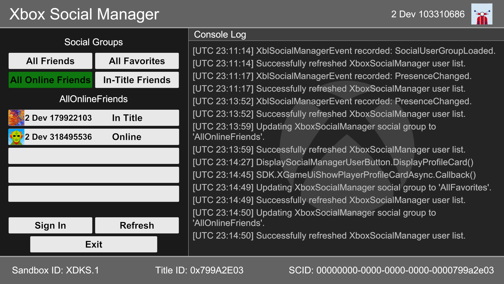
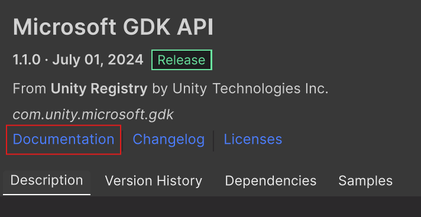

# Microsoft GDK Sample: Social Manager

**Relevant areas:** User Sign-in, Social Manager API, Friends

# Description

The Unity Social Manager sample demonstrates the usage of Xbox Live Social Manager using the Unity game engine. You can alter friend groups based on different levels of presence & relationships to find a specific group of users from the Xbox Services API.

# Building the Sample

For general information on how to run Unity GDK samples, see the samples section of the com.unity.microosft.gdk package documentation.

# Noteable Code Files

**XboxManager.cs**: Contains initialization of the Xbox GDK & Xbox Live Services APIs,
along with signing in a user & querying various information, such as Sandbox
& Title ID.

**XboxSocialManager.cs**: Contains APIs demonstrating the usage of the
Xbox Live Social Manager.

# Running the Sample

You will need an Xbox Live test account signed in to execute social
group changes & retrieving user statuses.

The desktop's sandbox **must** be set to XDKS.1.

**IMPORTANT:** In order to see results in the friends
section, you must have at least one friend linked to the Xbox user
logged in, via Friends or Favorites. A refresh is automatically
triggered on some Xbox Services events, such as presence changes or
social group updates.

*Social Group commands:*

-   '*All Friends'*

    -   XblPresenceFilter = XblPresenceFilter.All

    -   XblRelationshipFilter = XblRelationshipFilter.Friends

-   'All Favorites'

    -   XblPresenceFilter = XblPresenceFilter.All

    -   XblRelationshipFilter = XblRelationshipFilter.Favorite

-   *'All Online Friends'*

    -   XblPresenceFilter = XblPresenceFilter.AllOnline

    -   XblRelationshipFilter = XblRelationshipFilter.Friends

-   *'In-Title Friends'*

    -   XblPresenceFilter = XblPresenceFilter.TitleOnline

    -   XblRelationshipFilter = XblRelationshipFilter.Friends

**IMPORTANT:** These use a pre-defined combination of Xbox Services
presence & relationship filters to determine the retrieved Xbox users
related to the calling Xbox user.

*Friends section commands:*

-   '*Gamertag ... Status'* -- displays the gamertag & connection
    status of the first five users found that meet the social criteria
    of the current social group setting. Upon selection, it also
    displays the user's Xbox profile, via Xbox UI.

**IMPORTANT:** These are only displayed if there is a user that meets
the given criteria from the pre-defined filters. Otherwise, they remain
blank.

*Additional commands:*

-   '*Sign In'* -- allows for a new user to sign in using the Xbox user
    selection UI.

-   '*Refresh' ­*-- manually refreshes the user list of Xbox users.

-   '*Close' --* Closes the sample.
