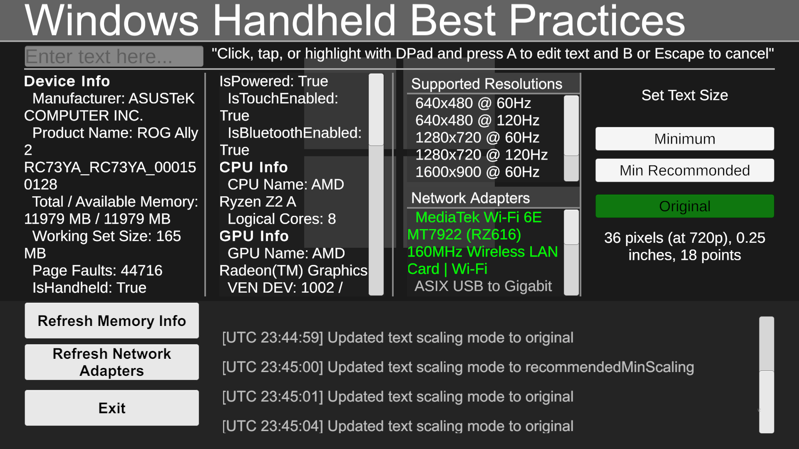

# Microsoft GDK Sample: Handheld Best Practices

**Relevant areas:** Handheld, Input, Audio, Graphics, CPU

# Description

This sample demonstrates the best practices for running a title on handheld devices, including how to:

- Determine if the device is a handheld
- Get various device properties
- Get integrated display properties
- Handle DPI changes and scale UI
- Display the virtual keyboard for text entry, and get user-entered text
- Determine network and Bluetooth connectivity
- Determine network devices and types
- Determine properties of current audio endpoint
- Handle input from Gamepad, Keyboard and Mouse
- Determine input modality (i.e. last input device used)

# Running the Sample

This sample does not use the GDK, so it can simply be run from the editor or built via __File > Build And Run__.

# Notable Code Files

**HandheldBestPracticesManager.cs**: Contains code for acquiring and displaying system information, as well as setting up listeners for input, audio, and memory changes.

**DeviceInfo.cpp**: Uses Win32 APIs to get system information; exported in HandheldHelper.dll files

**VirtualKeyboard.cpp**: Uses Windows Runtime APIs to show and hide the virtual keyboard; exported in HandheldHelper.dll files

# Implementation Notes

## Windows Runtime Functionality

This sample uses as many of Unity's built-in functionalities as possible to obtain system information. However, at the time of writing, certain functionalities such as identifying if Bluetooth is enabled or using the WinRT virtual keyboard (without building for UWP) are not available. To expose these capabilities, the _HandheldHelper_ DLL project was created.

The exported DLL's from this project are included in the `Plugins` directory for `x64` and `x86`. If further functionality is required, the source was included in the `HandheldHelper` project and can be extended. Simply rebuild the DLL's for both `x64` and `x86` targets, and replace the ones in the `Plugins` directory to update.

## UI Scaling

The `CanvasScaler` component for text and buttons was set up using the `Constant Physical Size` option. With conjunction with proper UI anchors and pivots, using this option ensures that the physical text size and placement are the same on any screen.

Check [Unity's documentation](https://docs.unity3d.com/Packages/com.unity.ugui@2.0/manual/script-CanvasScaler.html) for more information on the Canvas Scaler.

# Known Issues/Expectations

- If a device is in desktop or mouse/keyboard mode, Gamepad inputs will not be recognized. Ensure
the device is set to Gamepad mode via Armoury Crate or other OEM software.
- The Gamepad virtual keyboard requires Windows 11 24H2 or greater. If the device is running
an older version of Windows, the sample will not display the virtual keyboard.
- When running on a device that isn't a handheld, you may see errors regarding
GetDeviceScreenDiagonalSizeInInches and GetDeviceHDRStatus. These snippets are written
to only look at integrated displays, which may not exist on non-handheld devices.