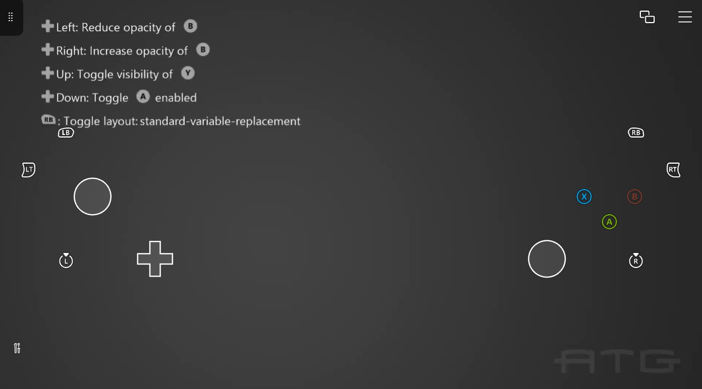

# 클라우드 변수 대체 샘플

*이 샘플은 Microsoft 게임 개발 키트와 호환됩니다(2022년 10월)*

# 설명

이 샘플에서는 게임 내에서 터치 적응 키트의 상태를 변경하는 방법을 보여줍니다.



# 샘플 사용

샘플을 시작하기 전에 게임 스트리밍이 사용하도록 설정되어 있는지 확인합니다. 또한 스트리밍 클라이언트(예: Xbox 게임 스트리밍 테스트 앱)에서 설정 > 개발자 > 터치 적응 > 사이드로드 사용이 사용하도록 설정되어 있는지 확인합니다. 스트리밍 클라이언트 앱을 사용하여 샘플을 실행하는 콘솔에 연결합니다. 연결되면 스트리밍 클라이언트의 현재 상태를 반영하도록 샘플을 변경해야 합니다. 게임 명령 프롬프트에서 다음 명령을 실행하여 "sample-layouts" 번들이 로드되었는지 확인합니다.

```
tak serve --takxconfig sample-layouts\takxconfig.json
```


dpad를 왼쪽과 오른쪽으로 눌러 TAK에서 B 버튼의 불투명도를 변경합니다. 방향 패드를 위로 눌러 Y 버튼의 표시 유형을 토글하고 방향 패드를 아래로 눌러 A 버튼의 사용 상태를 전환합니다.

# 구현 참고 사항

이 샘플에서는 xCloud에 클라우드 인식 API를 사용하는 방법을 보여 줍니다.

자세한 내용은 다음 설명서를 참조하세요. https://learn.microsoft.com/gaming/gdk/_content/gc/system/overviews/game-streaming/building-touch-layouts/game-streaming-touch-changing-layouts-game-state

# 버전 기록

2024년 4월:
- 화면 터치 레이아웃의 클라이언트별 제어를 허용하도록 `OnClient` API를 사용하는 샘플이 업데이트되었습니다.
- `takxconfig.json`을(를) `sample-layouts`에 추가했습니다.

2021년 7월: 초기 샘플

# 개인정보처리방침

샘플을 컴파일하고 실행하는 경우 샘플 사용량을 추적할 수 있도록 샘플 실행 파일의 파일 이름이 Microsoft에 전송됩니다. 이 데이터 수집을 옵트아웃하려면 Main.cpp에서 "샘플 사용량 원격 분석"이라는 레이블이 지정된 코드 블록을 제거할 수 있습니다.

일반적인 Microsoft의 개인 정보 정책에 대한 자세한 내용은 [Microsoft 개인정보처리방침](https://privacy.microsoft.com/en-us/privacystatement/)을 참조하세요.


