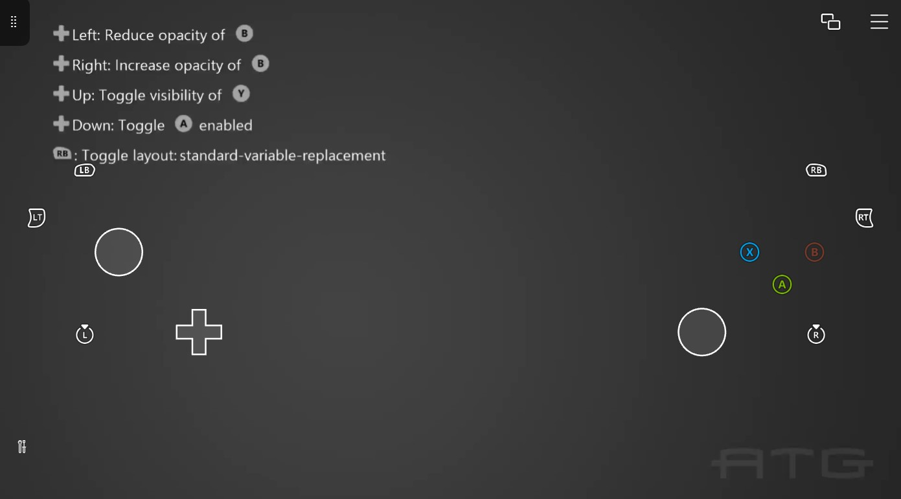

# 云变量替换示例

*此示例与 Microsoft 游戏开发工具包（2021 年 4 月）兼容*

# 说明

此示例演示如何从游戏中更改触摸适配工具包的状态。

# 使用示例

在启动示例之前，请确保已启用游戏流式处理。使用任何兼容的客户端应用（如
Xbox
游戏流式处理测试应用）连接到运行示例的主机。连接后，该示例应更改以反映流式处理客户端的存在。确保"标准控制器"TAK
已加载。

按触发器按钮可更改 TAK 上 B 按钮的不透明度。按 dpad 向上切换 Y 按钮和
dpad 的可见性，切换 A 按钮的启用状态。

# 实现说明

此示例演示如何使用适用于 xCloud 的云感知 API。

布局来自示例布局目录，同时也来自示例布局
GitHub：<https://github.com/microsoft/xbox-game-streaming-tools/tree/main/touch-adaptation-kit/samples>

# 版本历史记录

2021 年 7 月:初始示例

# 隐私声明

在编译和运行示例时，示例可执行文件的文件名将发送给
Microsoft，以帮助跟踪示例使用情况。若要选择退出此数据收集，你可以删除
Main.cpp 中标记为"示例使用遥测"的代码块。

有关 Microsoft 的一般隐私策略的详细信息，请参阅 [Microsoft
隐私声明](https://privacy.microsoft.com/en-us/privacystatement/)。
