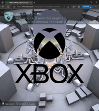

# Custom Resolution Sample

*This sample is compatible with the Microsoft Game Development Kit
(October 2022). It is intended to only be run on Xbox Series (Scarlett)
hardware.*

## Description

Console games will typically render at specific resolutions and almost
always with 16:9 aspect ratio. When streaming a game from xCloud
services, it is not always true that the target device will match either
resolution or aspect. Currently games would be rendered with letter or
pillar boxing to fit the device. By using some `XGameStreaming` API, the
game can be informed of the streaming device dimensions so it can both
adjust both its resolution and instruct xCloud to stream at a resolution
that better fits the display. This sample demonstrates usage of these
API for understanding device dimensions and adjusting rendering and
streaming resolution.

 

## Building the sample

The sample can target both `Gaming.Xbox.XboxOne.x64` and
`Gaming.Xbox.Scarlett.x64` platforms, but is only intended to be run on
Xbox Series (Scarlett) hardware due to streaming scenarios only
utilizing Xbox Series hardware.

## Using the sample

This sample uses the following controls:

| Action                            |  Gamepad                           |
|-----------------------------------|-----------------------------------|
| Bring up resolution menu          |  Menu                              |
| Rotate/zoom/adjust camera         |  Left stick/right stick            |
| Hide Xbox logo                    |  X                                 |
| Exit the sample                   |  View                              |

The sample is intended to be streamed to a streaming client, such as the
[web](https://www.xbox.com/play/dev-tools) or [Windows Streaming Content
Test](https://apps.microsoft.com/store/detail/xbox-game-streaming-test-app/9NZBPVPNLDGM)
app. Please see the
[documentation](https://learn.microsoft.com/en-us/gaming/gdk/_content/gc/system/overviews/game-streaming/game-streaming-setup-xbox-developer-kit)
on how to configure streaming from devkit to clients.

Once streaming, the sample will adjust to fit the current dimensions of
the streaming client display. Resizing the client will also adjust the
sample resolution to match the new dimensions. The way to see that it is
doing this properly is that both the Xbox logo, if visible, and the
sphere in the middle of the scene will always be perfectly round no
matter the aspect ratio of the display.

A menu can be brought up so that the sample can be set to one of a
preset list of resolutions. A corresponding button can be selected to
separately tell the streaming instance to stream at that resolution.
This is a contrived separation to demonstrate the effect of changing the
resolution independently of what the device streams at. Upon resize,
this happens in unison.

Some resolutions in the menu will intentionally throw errors, as there
are limits to the dimensions and number of pixels that streaming can
support (e.g. you cannot stream at full 4k resolution). This may change
over time.

More information about [Testing with Custom
Resolutions](https://learn.microsoft.com/en-us/gaming/gdk/_content/gc/system/overviews/game-streaming/game-streaming-testing-custom-resolution)
can be found in the documentation.

## Implementation notes

This sample reuses the scene and some structures and code from the
Dynamic Resolution sample. It is not intended to demonstrate graphics
best practices so there is likely code that is unnecessary to support
changeable but static resolutions. This should be cleaned up over the
time. The key is that the rendering resolution can adjusted upon resize
of when selected from a menu.

## Known issues

This sample requires the October 2022 GDK and recovery, or newer
versions.

This sample is not intended to be run on Xbox One hardware, as streaming
scenarios will not use that hardware.

Some UI will be cut off at certain resolutions; intelligent UI
reconfiguration and sizing is not part of the scope of this sample.

## Update history

**October 2022:** Initial release

## Privacy Statement

When compiling and running a sample, the file name of the sample
executable will be sent to Microsoft to help track sample usage. To
opt-out of this data collection, you can remove the block of code in
Main.cpp labeled "Sample Usage Telemetry".

For more information about Microsoft's privacy policies in general, see
the [Microsoft Privacy
Statement](https://privacy.microsoft.com/en-us/privacystatement/).
