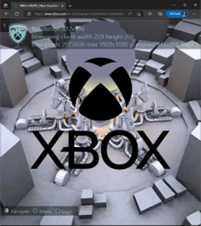

# 自定义分辨率示例

*此示例与 Microsoft 游戏开发工具包（2022 年 10 月）兼容 它仅在 Xbox Series （Scarlett） 硬件上运行。*

## 说明

主机游戏通常以特定分辨率呈现，并且几乎始终以 16:9 纵横比呈现。 从 xCloud 服务流式传输游戏时，目标设备的分辨率或宽高比并不总是一致。 目前，游戏将使用字母或柱状方框来呈现，以适应设备。 通过使用某些 `XGameStreaming` API，可以通知游戏流式处理设备尺寸，以便它可以调整其分辨率，并指示 xCloud 以更适合显示的分辨率进行流式传输。 此示例演示如何使用这些 API 来了解设备尺寸以及调整呈现和流式处理分辨率。

 

## 生成示例

该示例可以同时面向和 `Gaming.Xbox.XboxOne.x64` 和 `Gaming.Xbox.Scarlett.x64` 平台，但由于流式处理方案仅使用 Xbox 系列硬件，因此只能在 Xbox Series （Scarlett） 硬件上运行。

## 使用示例

此示例使用以下控件：

| 操作 | 游戏板 |
|---|---|
| 显示分辨率菜单 | 菜单 |
| 旋转/缩放/调整摄像头 | 左摇杆/右摇杆 |
| 隐藏 Xbox 徽标 | X |
| 退出示例 | 查看 |

该示例旨在流式传输到流式处理客户端，例如 [Web](https://www.xbox.com/play/dev-tools) 或 [Windows 流式处理内容测试](https://apps.microsoft.com/store/detail/xbox-game-streaming-test-app/9NZBPVPNLDGM) 应用。 请参阅
[文档](https://learn.microsoft.com/en-us/gaming/gdk/_content/gc/system/overviews/game-streaming/game-streaming-setup-xbox-developer-kit)
介绍如何配置从开发工具包到客户端的流式传输。

流式处理后，该示例将进行调整，以适应流式处理客户端显示的当前尺寸。 调整客户端的大小还将调整示例分辨率以匹配新尺寸。 可以看到它正确执行此操作的方法是，无论显示器的纵横比如何，Xbox 徽标（如果可见）和场景中间的球体始终都是完美的圆形。

可以启动一个菜单，以便可以将示例设置为分辨率的预设列表之一。 可以选择相应的按钮，以单独告知流式处理实例以该分辨率进行流式处理。 这是一个经过配置的分离，用于演示独立于设备流式传输的内容更改分辨率的效果。 调整大小时，这种情况会同时发生。

菜单中的某些分辨率会有意引发错误，因为流式处理可以支持的尺寸和像素数存在限制（例如，不能以 4k 全分辨率进行流式传输）。 这可能会随时间推移而改变。

有关 [使用自定义分辨率](https://learn.microsoft.com/en-us/gaming/gdk/_content/gc/system/overviews/game-streaming/game-streaming-testing-custom-resolution) 进行测试的详细信息，请参阅文档。

## 实现说明

此示例重用动态分辨率示例中的场景以及一些结构和代码。 它并不旨在演示图形最佳做法，因此可能存在支持可更改但静态分辨率所需的代码。 随着时间的推移，这种情况应该会得到改善。 关键在于，从菜单中选择时，呈现分辨率可以在调整大小时进行调整。

## 已知问题

此示例需要 2022 年 10 月 GDK 和恢复或更新的版本。

此示例不应在 Xbox One 硬件上运行，因为流式处理方案将不使用该硬件。

某些 UI 将在某些分辨率下被截断；智能 UI 重新配置和大小调整不是本示例范围的一部分。

## 更新历史记录

**2022 年 10 月：** 初始版本

## 隐私声明

在编译和运行示例时，将向 Microsoft 发送示例可执行文件的文件名以帮助跟踪示例使用情况。 若要选择退出此数据收集，你可以删除 Main.cpp 中标记为&ldquo;示例使用遥测&rdquo;的代码块。

有关 Microsoft 的一般隐私策略的详细信息，请参阅 [Microsoft 隐私声明](https://privacy.microsoft.com/en-us/privacystatement/)。

