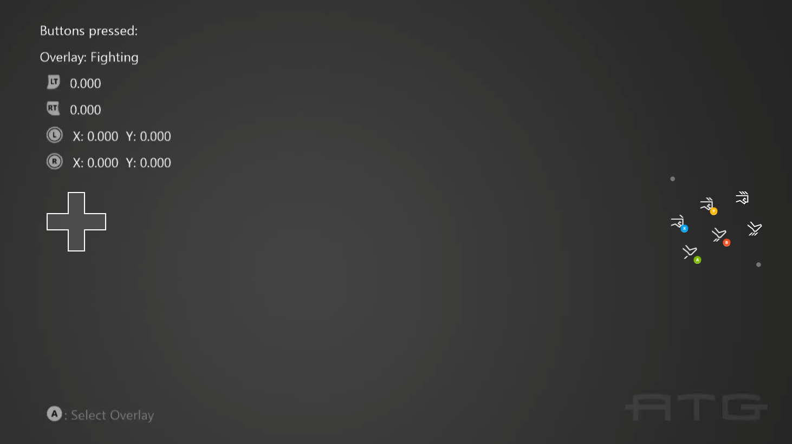

# シンプルなクラウド対応のサンプル

*このサンプルは Microsoft Game Development Kit (2021 年 4 月)
と互換性があります*

# 説明

このサンプルでは、ゲーム ストリーミング
クライアントの検出方法、画面上のコントロール
レイアウトの変更方法、タッチ ポイントの読み取り方法を示します。

# サンプルの使用方法

サンプルを起動する前に、ゲーム
ストリーミングが有効になっていることを確認します。これは、Dev Home の
\[ストリーミング\] セクションで行うか、ゲーム コマンド プロンプトから
xbgamestream startlisten を実行できます。

互換性のあるクライアント アプリ (Xbox ゲーム ストリーミング テスト
アプリなど)
を使用して、サンプルを実行しているコンソールに接続します。接続したら、ストリーミング
クライアントの存在を反映するようにサンプルを変更する必要があります。

このサンプルには、Gaming コマンド
プロンプトで実行して読み込むことができるサンプル
レイアウトが含まれています。

tak serve \--takx-file sample-layouts.takx

ボタンを押して表示を確認し、サムスティックとトリガーを移動して読み取り値を表示します。A
(またはオーバーレイの A 相当)
を押して、新しいオーバーレイに切り替えます。クライアントがタッチ対応の場合は、画面をタッチしてタッチポイントが読み取られていることを確認します。

# 実装上の注意

このサンプルでは、xCloud 用クラウド対応 API の使用方法を示します。

レイアウトはサンプルレイアウト GitHub:
<https://github.com/microsoft/xbox-game-streaming-tools/tree/master/touch-adaptation-kit/touch-adaptation-bundles>
からのものです。

# バージョン履歴

2021 年 5 月初期サンプル

2022 年 3 月更新して初期化コードを修正する

# プライバシーに関する声明

サンプルをコンパイルして実行する場合、サンプルの使用状況を追跡するために、サンプル実行ファイルのファイル名が
Microsoft に送信されます。このデータ
コレクションからオプトアウトするには、Main.cpp の「Sample Usage
Telemetry」というラベルの付いたコードのブロックを削除します。

全般的な Microsoft のプライバシー ポリシーの詳細については、「[Microsoft
プライバシー
ステートメント](https://privacy.microsoft.com/en-us/privacystatement/)」を参照してください。
